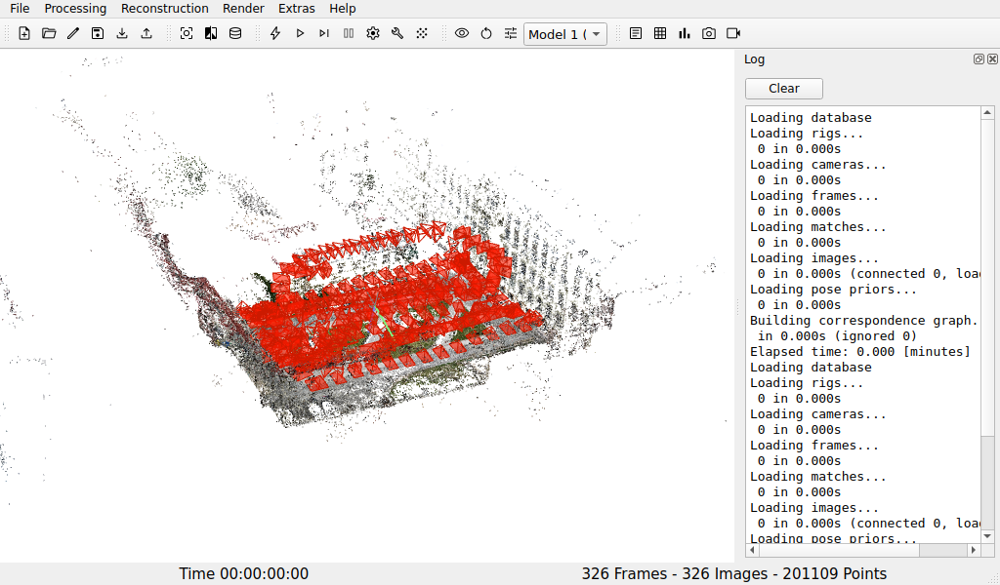
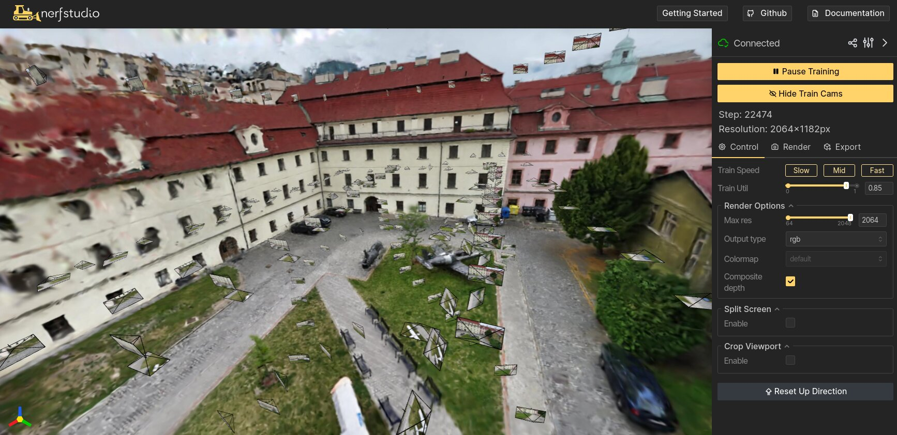
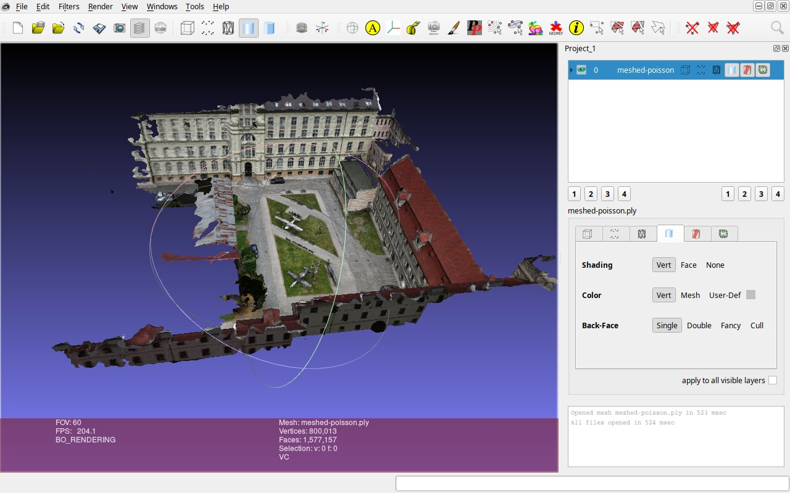
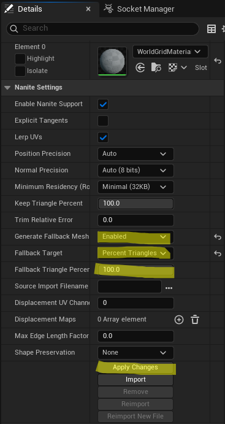
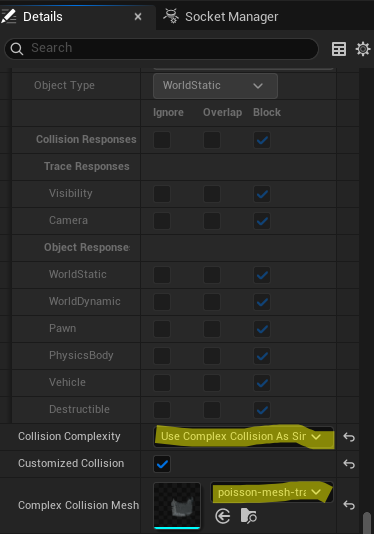
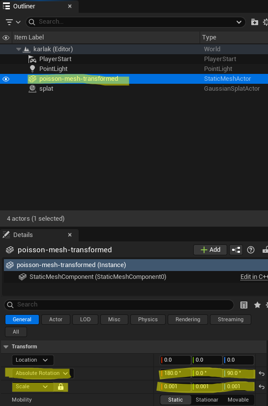

# Gaussian Splat model generation

This repository provides a comprehensive tutorial and automated scripts for generating 3D Gaussian Splats and dense meshes from images.
Together, these allow you to create highly accurate digital twins of real-world environments in Unreal Engine.
The Gaussian splats deliver photorealistic visuals, while the perfectly aligned 3D mesh enables accurate physical interactions like collisions and LiDAR simulations.

## Prerequisities

### Disk space

Be ready with at least 30 GB of free disk space just for the splat and mesh generation.
Additional 100 GBs might be needed for Unreal Editor and the related works.

### Graphics card

Having a dedicated nvidia graphics card helps.
This tutorial has been developped and tested with GTX 4060 with 8 GB of memory, running the 570.211.01 driver (CUDA 12.8).
The Unreal Engine 5.7 requires nvidia driver 570 or higher.
I recommend sticking to this one.

### Nvidia container toolkit

```bash
curl -fsSL https://nvidia.github.io/libnvidia-container/gpgkey | sudo gpg --dearmor -o /usr/share/keyrings/nvidia-container-toolkit-keyring.gpg \
  && curl -s -L https://nvidia.github.io/libnvidia-container/stable/deb/nvidia-container-toolkit.list | \
    sed 's#deb https://#deb [signed-by=/usr/share/keyrings/nvidia-container-toolkit-keyring.gpg] https://#g' | \
    sudo tee /etc/apt/sources.list.d/nvidia-container-toolkit.list

sudo apt-get update
sudo apt-get install -y nvidia-container-toolkit
sudo nvidia-ctk runtime configure --runtime=docker
sudo systemctl restart docker
```

### Colmap docker image

You will need the `Colmap` docker image with the right CUDA version.
You can get easily build our own:

1. Determine your CUDA version by `nvidia-smi`.
2. Clone colmap (4.0.4 at the time of writing this tutorial):
```bash
git clone https://github.com/colmap/colmap --branch 4.0.4
```
3. `cd docker`
4. modify the CUDA version in the `Dockerfile`
5. run `./build.sh`

The `klaxalk/colmap:latest` is currently the `4.0.4` version with CUDA `12.8`

### Meshlab

Meshlab can be used for inspecting the results.

```bash
sudo apt install meshlab
```

### The Nerfstudio docker image

You will need `Nerfstudio` in docker.
```bash
docker pull klaxalk/nerfstudio:latest
```
The `klaxalk/nerfstudio:latest` image is `v1.1.5` at the time of writing this tutorial.

### Unreal Engine 5.7

I recommend to use the NanoGS UE plugin ([NanoGS for UE 5.7 fixed for Linux](https://drive.google.com/file/d/1tNLNAxK7WzqxuNhSFHaO_brW1yEVd13w/view?usp=sharing)) in Unreal Engine 5.7.4.
Older engine versions do not support this plugin.

## The pipeline

### 1. input data

The 3D model is generated from a series of images, that should be placed into the `00_data/images` folder.

Alternatively, you can extract the images from a video:
1. Copy the video to `00_data/video.mp4`.
2. Modify `01_data_preparation/01_extract_images.sh` to configure the extraction method: fixed rate or fixed image count.
3. Run `./01_data_preparation/01_extract_images.sh` (minutes to tens of minutes).
4. The images should appear in `00_data/images`.

> [!CAUTION]
> The whole process is "Garbage in, garbage out" pipeline. If your dataset is poor, the outcome will be poor as well. It is recommended to process the images by hand to remove any images with motion blur or with defects.

> [!TIP]
> Use between 200 and 800 images. More images create a difficult problem for solving.

> [!TIP]
> When gathering images, make sure the data contain parallel motion, rather than rotation. Cover the scene with duplicate viewpoints (different 3D locations).

### Camera registration (Sparse reconstruction)

Sparse reconstruction is the necessary steps for creating a Gaussian splat.
Moreover, it is also needed for 3D mesh generation (for simulating LiDAR and collisions).

1. `./02_camera_registration/01_extract_features.sh` (minutes to tens of minutes)
2. `./02_camera_registration/02_feature_matching.sh` (tens of minutes)
3. `./02_camera_registration/03_sparse_reconstruction.sh` (tens of minutes to hours)

The outcome of this process is a sparse model with camera poses.
The model can be checked via _Colmap GUI_:
```bash
./02_camera_registration/04_gui_visual_check.sh
```
In the GUI, select **File->import model** and select the folder ``/working/workspace/sparse/0``.
You should see the following visual:


### Gaussian Splat generation

The Gaussian splat generation is an optimization process that will gradually produce finer visual model.

1. `./03_splat_generation/01_convert_to_nerfstudio.sh` (minutes).
2. `./03_splat_generation/02_splatfacto.sh` (tens of minutes to hours).

You can check the process in real time at `http://127.0.0.1:7007`.


3. `./03_splat_generation/03_export_splat.sh` (minutes).

Now you can inspect the splat in `https://superspl.at/editor`.
Import the file `./00_data/splat_export/splat.ply`.

> [!TIP]
> You can interrupt the splat generation. If you run it again, it will resume from a saved checkpoint.

> [!TIP]
> The quality of the splat is directly influenced by the image downsample factor, which can be set in the script. If you have enough GPU memory, you don't have to downsample.

### Dense reconstruction (Mesh generation)

In order to simulate collisions and LiDAR, we need a dense 3D mesh.
The mesh is not pretty, but serves as a physical model for collision checking.
The dense reconstruction is the most time-consuming part of the whole pipeline.

1. `./04_dense_reconstruction/01_undistort_images.sh` (tens of minutes).
2. `./04_dense_reconstruction/02_stereo_reconstructions.sh` (hours).
3. `./04_dense_reconstruction/03_stereo_fusion.sh` (tens of minutes).
4. `./04_dense_reconstruction/04_poisson_mesh.sh` (minutes to tens of minutes).

Now you can inspect the mesh by `meshlab ./00_data/workspace/dense/meshed-poisson.ply`


> [!TIP]
> It might make sense to first build a quality splat using a many images (1000+) and then running the sparse + dense pipeline for a subset of the images (~400) to just obtain the mesh.

### Postprocessing

After generating the Gaussian splat and the 3D mesh, we need to transform the mesh into the coordinate system of the splat (the coordinate frame is "normalized" before the splat generation to prevent computational problems.

1. `./05_postprocessing/01_create_python_env.py`
2. `./05_postprocessing/02_transform_mesh.sh`

### The output

Now you can extract the Gaussian Splat and the Mesh
* `./00_data/splat_export/splat.ply`
* `./00_data/poisson-mesh-transformed.glb`

## Integrating into Unreal Engine

### Loading the Gaussian Splat

1. Add the NanoGS plugin ([NanoGS for UE 5.7 fixed for Linux](https://drive.google.com/file/d/1tNLNAxK7WzqxuNhSFHaO_brW1yEVd13w/view?usp=sharing)) into the _Plugins_ folder within your project and let it compile.
2. Import the `splat.ply` file.
3. Drag the splat into the scene.
4. Set **Position** to 0, 0, 0

### Loading the mesh

1. Import the mesh file (`poisson-mesh-transformed.glb`).
2. Adjust the meshes collision settings:
  * (top menu) Collision->Remove collision
  * (Details) Complex collision mesh: select the same mesh you are editing right now
  * (Details) Collision complexity: Use complex collisions as simple
  * (Details) Nanite Settings->Generate fallback mesh: Enabled
  * (Details) Fallback Target->Percent triangles
  * (Details) Fallback Triangle Percentage: 100
  * (Details) **Then click to Apply**
  * Save the mesh
  * Drag the mesh into the scene
4. Rotate and scale the mesh to match the Gaussian splat.
  * Set **Position** to 0, 0, 0
  * Set the **Absolute rotation** of the mesh to 180, 0, 90
  * Set the scale to 0.001





### Final touches

1. Now rotate and scale the mesh with the splat together to match the real orientation and size. The actual scale of the splat and mesh is now arbitrary.
2. Make the mesh invisible.
